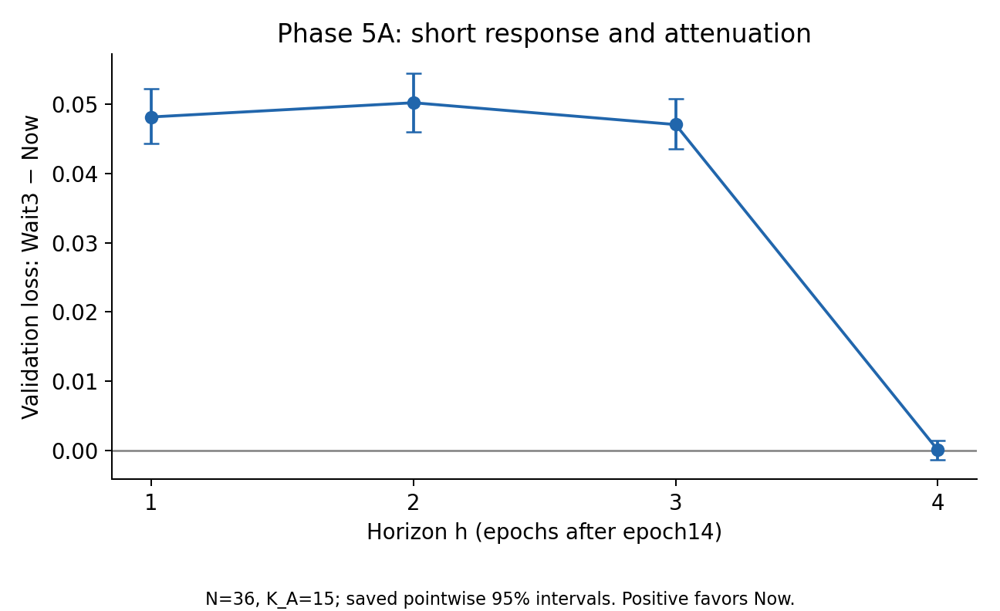

# ReflexML

**学习率干预、训练动力学与排程重新统一后效应衰减的受控实证研究**

**项目状态：COMPLETE / FROZEN**  
冻结日期：2026-09-29  
作者：**Peiyuan Ma**

从相同训练状态出发，立即或延迟降低学习率，究竟会改变什么？ReflexML 观察到稳定的短期损失差距，以及排程重新统一后的明显衰减；机制对照提供了有限约束，外部复现和短期—长期关联仍有未解决的问题。最终，项目因论文级新颖性的边际收益不足而停止扩张，保留为一项完成的受控实证研究。

## 一、项目简介

ReflexML 从相同训练 checkpoint 分出多个分支，控制学习率干预时机与未来随机性，研究四个问题：

- 短期学习率干预产生多大影响？
- 干预效应如何随训练继续演化？
- 两个分支的学习率排程重新统一后，已有差距如何衰减？
- 短期响应是否包含关于后续效果的可靠信息？

项目不提出新优化器或新理论。主要实验采用固定的 Fashion-MNIST、MLP 和带 momentum 的 SGD 设置，并保留 MNIST 外部测试的部分复现结果。

## 二、实验设计

- **相同 checkpoint 分支（same-checkpoint branching）**：从相同模型参数、优化器状态及所需随机状态开始，改变预先指定的学习率处理。
- **配对随机未来（paired stochastic futures）**：配对分支使用匹配的实际 minibatch 顺序，减少未来随机性对比较的干扰。
- **不依赖结果选择的状态（outcome-independent states）**：Phase 5 的 36 个独立训练状态不根据后续干预效果筛选。
- **冻结估计目标（frozen estimands）**：预先定义短期平均响应、最终效应和跨状态协方差；区分独立状态与同一状态下的重复未来。
- **Now vs Wait-d**：Now 从 epoch15 将 LR 从 .10 降至 .05；Wait-d 保持 .10 共 d 个 epoch，随后降至 .05。Phase 5 使用 Wait3；后续 Wait-d 测试 d=1–4。

```text
                   相同完整 checkpoint S
                            │
                 ┌──────────┴──────────┐
                 │                     │
                Now                  Wait-d
            立即降低 LR          延迟 d 个 epoch 后降低 LR
                 │                     │
                 └── 匹配未来 minibatch 顺序 ──┘
                            │
                       比较验证集损失
```

Phase 5 每个状态的 A 块有 15 个配对未来，用于测量短期响应；独立的 B 块有 10 个配对未来，用于测量最终效应。重复未来不增加独立状态数。详细定义见[实验设计导读](docs/EXPERIMENT_DESIGN.md)与[冻结协议](PHASE5_DESIGN.md)。

## 三、主要结果

下表中的正损失差值表示 Now 或 LR=.05 占优。结果均限定于相应的测试设置，数值按公开展示精度取舍。

| 实验 | 冻结结果 | 解释边界 |
| --- | --- | --- |
| Phase 5A | h1–h3 的 Wait−Now gap 稳定为正，平均约 0.04847；h4 均值约 0.0000903，几乎完全衰减 | 接近零不等于严格等价，也不证明训练历史被遗忘 |
| LR-switch | 相同 S17 状态与配对未来下，LR=.05 相比 .10 形成即时验证损失优势；epoch18 终点差值 0.04110，95% CI [0.03385, 0.04871] | 终点受控效应不能替代对整个历史轨迹的解释 |
| Momentum Reset | 清除继承自 S17 的 momentum 后，主要 LR 效应仍存在，差值约 0.04440 | 继承 momentum 单独不足以解释主要 LR 效应；主要交互仍未确定 |
| m=4 | 改变梯度构造后，LR contrast 从约 0.04842 大幅减弱至 0.01173，但未消失 | m=4 是复合干预，同时改变梯度构造与批次暴露，不能解释为纯 gradient-noise removal |
| Wait-d | d=1–4 均观察到排程重新统一后的明显衰减；Fashion-MNIST，N=12、K=2，冻结分类 GO | 在测试设置中并非 Wait3 特异；不构成 timing law，GO 不授权继续实验 |
| MNIST | 仅观察到部分结构性衰减（partial structural attenuation）；最终 N=12、K=2，分类 **AMBIGUOUS** | 强衰减未得到复现，不能称为 strong replication |
| Phase 5B | rho(S) 与 tau(S) 的跨状态协方差区间跨零；**INCONCLUSIVE / association precision insufficient** | 关联精度不足，不能据此声称无关联、负关联或不可预测 |

[精确冻结数值与结论边界](docs/FINAL_SCIENTIFIC_SNAPSHOT.md) · [已保存的结果摘要](results/README.md)



验证损失差 Wait3−Now；N=36、K_A=15。误差条为已保存的逐点 95% 区间，正值表示 Now 占优。h4 位于排程重新统一之后；图中接近零不代表严格零效应。

## 四、项目不支持哪些结论

ReflexML **没有证明**：

- 一般性的学习率排程新定律；
- training history 被完全遗忘；
- momentum 无关；
- gradient noise 是主要或唯一机制；
- Wait-d 存在单调 timing law；
- rho(S) 可以可靠预测 tau(S)；
- rho(S) 与 tau(S) 没有关系；
- Fashion-MNIST 与 MNIST 的差异由数据集身份本身导致。

同样，项目没有建立唯一机制或新的因果推断方法。阴性、不确定和未完全复现的结果都是研究记录的一部分。

## 五、为什么项目最终停止扩张

实验结果本身具有较高可重复性，也产生了若干有信息量的机制约束。但经过多轮对抗性文献审查，现有结果与已有 learning-rate transition、trajectory contraction、training dynamics 等研究之间的剩余差异，不足以在可接受边际成本下构成独立、足够新的论文级 scientific claim。

最终新颖性判断：**NONE — NO DEFENSIBLE PAPER POINT AT ACCEPTABLE MARGINAL COST**。项目定位：**ONLY AS A REPLICATION / CONTROLLED EMPIRICAL STUDY**。

最终决定：**FREEZE AND WRITE UP AS A CONTROLLED STUDY**。这是一项保留已有证据、明确贡献上限的停止决策，不再通过追加实验寻找更强的论文主张。

## 六、研究价值

项目保留的价值在于受控实验设计、配对随机未来、冻结协议、精确重放（exact replay）、外部复现尝试、阴性与不确定结果的保存，以及明确的停止决策和可检查的研究流程。这些是研究实践与工程资产，不作为新的 methodology contribution。

## 七、仓库结构

| 位置 | 内容 |
| --- | --- |
| `docs/` | 最终科学快照、设计导读、停止决策、研究复盘与证据报告 |
| `reflexml/` | 模型、checkpoint、分支、估计目标与后续对照的 Python 实现 |
| `scripts/` | 公开版验证脚本、基于冻结数值的绘图脚本 |
| `tests/` | 选定的合成单元测试与完整性测试 |
| `results/summaries/` | 已保存的冻结 JSON / CSV 摘要 |
| `results/figures/` | 三张基于已保存结果的说明图 |
| `reproduce/` | 可运行的验证命令与完整复现的限制 |

## 八、复现说明

### 轻量级验证

可运行合成 unit tests、结果摘要与文件哈希检查、模块导入及 CLI 帮助检查。已验证命令与测试范围见[复现说明](reproduce/README.md)及[公开发布报告](docs/PUBLIC_RELEASE_REPORT.md)。这些检查不执行科学训练或重新计算推断统计。

### 完整科学复现

完整复现部分实验需要未包含在公开仓库中的原始 checkpoints / raw artifacts，以及配对顺序记录、来源记录和原始运行环境。公开仓库不是完全 self-contained 的精确重放归档；涉及未公开执行基础设施的生产路径不受支持。保留图表仅呈现已有冻结数值。

## 九、核心文档

核心科学文档暂保留英文，避免产生重复且可能分歧的翻译版本。

- [Final Scientific Snapshot](docs/FINAL_SCIENTIFIC_SNAPSHOT.md)：最终证据表、精确数值、来源层级和允许的结论。
- [Research Postmortem](docs/RESEARCH_POSTMORTEM.md)：研究选择、主线漂移和测量精度的复盘，以及面向其他项目的选择流程。
- [Novelty and Stopping](docs/NOVELTY_AND_STOPPING.md)：最终新颖性判断、停止理由与对话来源说明。
- [Public Release Report](docs/PUBLIC_RELEASE_REPORT.md)：发布文件范围、排除项、隐私检查和验证结果。

代码采用 [MIT License](LICENSE)。作者与软件引用信息见 [CITATION.cff](CITATION.cff)；不声明 DOI、发表场所或机构背书。
